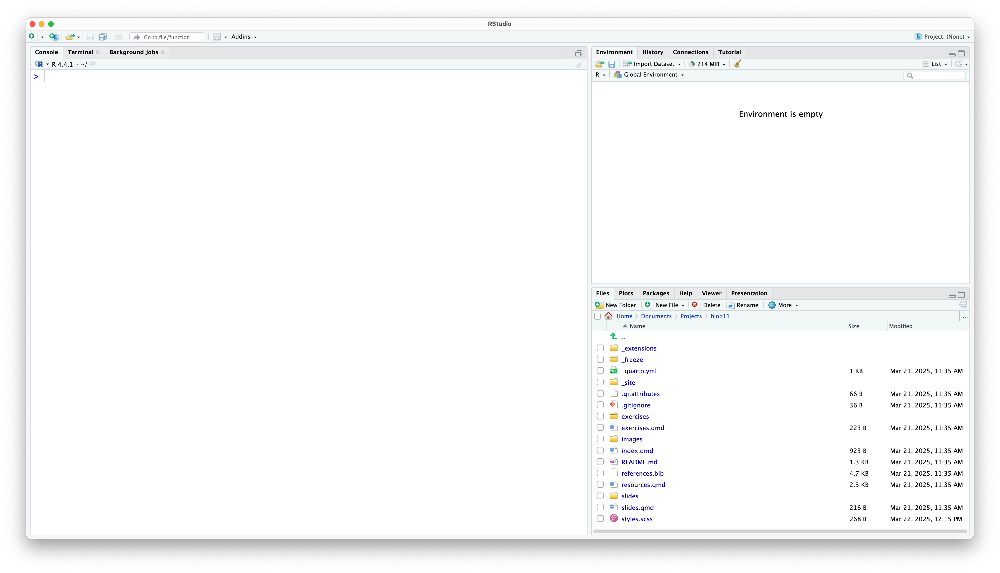
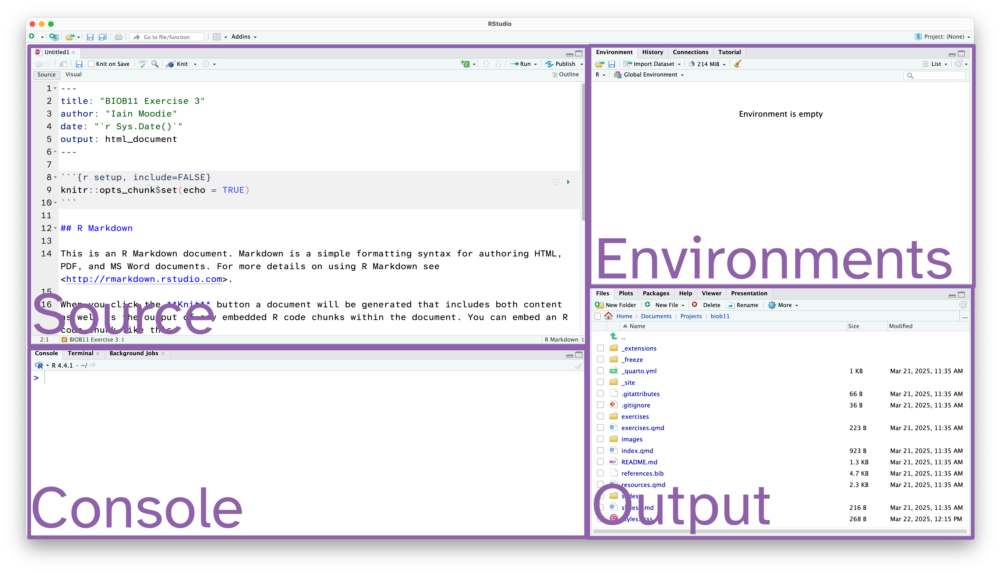
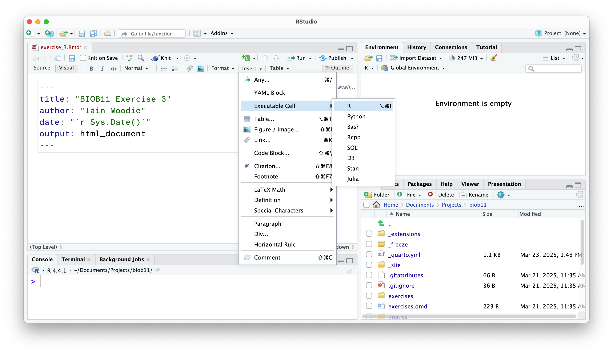
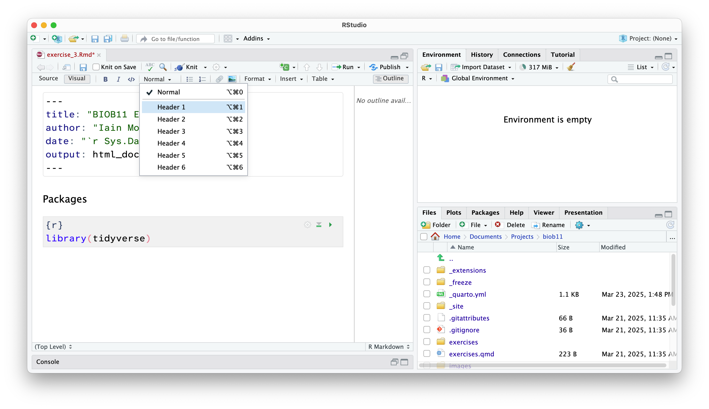
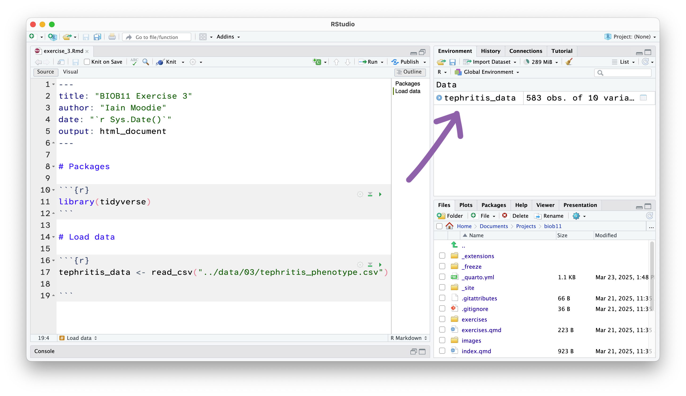

To complete this exercise, work your way through this tutorial. Complete all
sections marked as ✅ **Task**. As this component is mandatory, you need to
complete the ✅ **Final Task** by submitting your work via the [Canvas
assignment](https://canvas.education.lu.se/courses/39437/assignments/275273).
The deadline is a suggestion. If you feel you can't get finished in the alloted
time, submit what you have done. You will recieve feedback on your work.

# Welcome to *RStudio*

::: {.callout-note icon="false"}
## ✅ Task

Launch RStudio.

:::

It should detect your R installation automatically, but if not, a window will
open asking you to select it. If R does not appear here, I suggest you restart
your computer first.

You should be met by a scene that looks like this:



Rstudio is designed around a four panel layout. Currently you can see three of
them. To reveal the fourth, go to *File* -> *New file* -> *R markdown..*. This
will open an RMarkdown document, which is a form of coding "notebook", where you
can mix text, images and code in the same document. We will use these sorts of
documents extensively in this course. Give your document a title like "BIOB11
Exercise 4". You can put your name for author, and leave the rest as default for
now. Click OK. Now your window should look something like this:



1. **Source**: This is where we edit code related documents. Anything you want
   to be able to save should be written here.
2. **Console**: the console is where R lives. This is where any command you
   write in the source pane and run will be sent to be executed.
3. **Environments**: this panel shows you objects loaded into R. For example, if
   you were to assign a value to an object (e.g.`x <- 1`), then it would appear
   here.
4. **Output**: this panel has many functions, but is commonly used to navigate
   files, show plots, show a rendered RMarkdown file or to read the R help
   documentation.

## RMarkdown

RMarkdown is a file format for making dynamic documents with R. It combines
plain text with embedded R code chunks that are run when the document is
rendered, allowing you to include results *and* your R code directly in the
document. This makes it a powerful tool for creating reproducible analyses,
which are extremely important in science.

The RMarkdown document you opened has some example text and code. An RMarkdown
document consists of three main parts:

1. **YAML Header**: This section, enclosed by `---` at the beginning and end,
   contains metadata about the document, such as the title, author, date, and
   output format.

2. **Text**: You can write plain text using Markdown syntax to format it.
   Markdown is a lightweight markup language with plain text formatting syntax,
   which is easy to read and write.

3. **Code Chunks**: These are sections of R code enclosed by triple backticks
   and `{r}`. You can click the green arrow to run all the code in a code chunk,
   or run each line of code using the *Run* button, or by using `Ctrl+Enter`
   (Windows) or Cmd+Enter (macOS)When the document is rendered, the code is
   executed, and the results are included in the output.

Notice at the top left of the *Source* panel, there are two buttons: *Source*
and *Visual*. These allow you to switch betwee two views of the RMarkdown
document. The *Source* view is what you are looking at, and it is the raw text
document. You can also use the *Visual* view, which allows you to work in a
WYSIWYG (what you see is what you get) view, similar to Microsoft Office or
other text editors. This "renders" your markdown code for you while you write.
It also gives you a series of menus to help you format text, which means you do
not need to learn [how to write markdown
code](https://rmarkdown.rstudio.com/authoring_basics.html) (although it is
extremely simple, and you likely know some already).

Which ever view you prefer (and you can switch as often as you like), the code
part stays the same. It is primarily there for editing the text around your
code.

## Important settings

Before we go any further, we need to change some default settings in RStudio.

::: {.callout-note icon="false"}
## ✅ Task

Go to *Tools* -> *Global Settings*, then:

1. Go to the *General* tab.
    i) **Un-tick** "*Restore .RData into workspace at startup*"
   ii) Set "*Save workspace to RData on exit:*" to *Never*.
2. Go to the *Code* tab
   i) **Tick** "*Use native pipe operator, l> (requires R 4.1+)*"

:::

While we are here, if you wanted to change the font size or theme, you can do
that in the *Appearance* tab.

RStudio also has screenreader support. You can enable that in the
*Accessibility* tab.

## Working directory

**I strongly recommend you create a folder where you save all the work you do as
part of this section of the course.** I also recommend you make this folder in a
part of your computer that is **not** being synced with a cloud service (iCloud,
OneDrive, Google Drive, Dropbox, etc). These services can cause issues with
RStudio. You can always backup your work at the end of a session.

::: {.callout-note icon="false"}
## ✅ Task

Within your new course folder, I also want you to **make a new folder for each
exercise we do**. This will make it easier for you to stay organsied. It also
makes your code reproducible by simply sending someone the contents of the
folder in question. For example, this is exercise 2, so my main folder might be
called `bioc13`, and within that folder I might make a folder called
`exercise_1`.

We now want to set our *working directory* to this `bioc13/exercise_1` folder. A
working directory is the directory (folder) in a file system where a user is
currently working. It is the default location where all your R code will be
executed and where files are read from or written to unless specified otherwise.
To set the working directory using RStudio, go to *Session* -> *Set working
directory* -> *Choose directory*, then navigate to the folder you just made for
this exercise. You should do this at the start of each exercise.

:::

Notice that now in your *Output* pane, in the *files* tab, you can see the
contents of your folder (which is probably nothing currently). Let's change
that.

## Saving your document

Let's save this example RMarkdown document that RStudio has made for us. You do
that exactly how you might expect.

::: {.callout-note icon="false"}
## ✅ Task

Go to *File* -> *Save*, or use the floppy disc icon. Ensure you save it in your
working directory with a descriptive name (e.g. `exercise_1.Rmd`).
:::

The file should have appeared in your *Output* pane, with the extension `.Rmd`.
You might have to click the refresh button.

## Installing R packages

In this section of the course, we will use the `tidyverse` package, and the
`infer` package. To install them you need to use the `install.packages()`
function. Since we only need to do this once per computer, we should run this
function directly in the *Console* panel.

::: {.callout-note icon="false"}
## ✅ Task

Type or copy the install function into the *console*, and press enter to run:
:::

```{r}
#| echo: true
#| eval: false

install.packages("tidyverse")
install.packages("infer")
```


From now on, we won't write things directly in the *Console*, and instead write
code in the RMarkdown document in the *Source* panel, which we then "Run" and
send the *Console*.

## Delete the demo text

When you make a fresh Rmarkdown document, it comes with some text and code to
demo the features. We want to remove that before continuing.

::: {.callout-note icon="false"}
## ✅ Task

Delete all the code and text that RStudio automatically generated, except the
YAML header (the text at the start between the `---`). You can do that as you
would expect in any other text editor.

:::

## Creating code cells

Code cells are where we write code in an RMarkdown document. This allows use to
write normal text outside these sections.

::: {.callout-note icon="false"}
## ✅ Task

In your *Source* panel, in the RMarkdown document, add a R code cell.

:::

::: {.callout-note collapse="true" icon="false"}
### Visual view

To do that in the *Visual view* (where the text is rendered), go to *Insert* ->
*Executable Cell* -> *R*.


:::

::: {.callout-note collapse="true" icon="false"}
### Source view

To do that in the *Source view* (where we see just plain text), we use three
back-ticks (```` ``` ````) to mark the start and end of a code cell.
Additionally at the start, we declare the language used by enclosing it in two
curly brackets `{r}`.

````markdown
```{{r}}

```
````
:::

In both views, you can also use the shortcut *Shift-Alt-I* or *Shift-Command-I*.

## Adding headings and text

Anywhere outside a code cell you can write normal text. In this course, you
might find it helpful to write yourself notes alongside your code, so that you
can come back to your notes during other exercises, the exam (open book), the
group project, or later in your studies.

Along side normal text, you can structure an RMarkdown document using headings.

::: {.callout-note icon="false"}
## ✅ Task

Add a heading *above* the code cell you just made titled "Packages".

:::

::: {.callout-note collapse="true" icon="false"}
### Visual view

Change the type of text you are typing in the menu at the top:


:::

::: {.callout-note collapse="true" icon="false"}
### Source view

Use `#`s to indicate the level of the heading:

```markdown
# Heading level 1
## Heading level 2
### Heading level 3
```
:::

## Loading R packages

After installing an R package, we need to load it into our current R
environment. We use the `library()` function to do that. Since we need this code
to run every time we come back to this RMarkdown document, we should write it in
the document. R code should always be executed "top to bottom", so this bit of
code should come right at the start.

::: {.callout-note icon="false"}
## ✅ Task

Inside that code cell you just made, use the `library()` function to load the
`tidyverse` and `infer` packages:

```{r}
#| echo: true
#| eval: false

library(tidyverse)
library(infer)
```

(To run code in the *Source* panel, you can click on the line you want to run,
and then press the "Run" button. Or you can also use the keyboard shortcut
`Ctrl+Enter` or `Cmd+Return`.)
:::

If that worked, you will get a message that reads something similar to:

```{r}
#| echo: false
#| eval: true

library(tidyverse)
library(infer)
```

This message tells us which packages were loaded by the `tidyverse` package, and
which functions from base R (the functions that come with R by default) have
been overwritten by the `tidyverse` packages. Not all packages produce a message
when they are loaded (for example, `infer` did not).

Let's move onto working with some data!

--------------------------------------------------------------------------------

# A walkthrough analysis

Today we will work with a dataset called `tephritis_phenotype.csv`. The dataset
comes from a study conducted at Lund University by @nilsson2022.

## Background

The dataset describes morphological measurements (lengths, widths of different
body parts) of the fly *Tephritis conura*. This species has specialised to
utilise two different host plants (`host_plant`), *Cirsium heterophyllum* and
*C. oleraceum*, and formed stable "host races". Individuals of both host races
were collected in both sympatry (where both *Cirsium heterophyllum* and *C.
oleraceum* host plants co-occur) and allopatry (where only one *Cirsium* species
occurs) (`patry`) from eight different populations in northern Europe (`region`)
from both sides of the Baltic sea (`baltic`). Individuals were measured after
having been hatched in a common lab environment. One female and one male (`sex`)
from each bud was measured. The authors took magnified photographs of each
individual, and of the wings of each individual.


Measured traits included the length of a wing (`wing_length_mm`), the width of a
wing (`wing_width_mm`), the amount of the wing that was melanised
(`melanized_percent`), the length of the body (`body_length_mm`) and the length
of the ovipositor (`ovipositor_length_mm`).

::: {.callout-note icon="false"}
## ✅ Task

1. Download the dataset from
   [Github](https://github.com/irmoodie/teaching_datasets/blob/main/tephritis_phenotype_clean/tephritis_phenotype.csv).

{width=50%}

2. Move the downloaded `tephritis_phenotype.csv` file to your *working
   directory* folder.

If the GitHub download doesn't work (sometimes the university gets rate
limited), you can also download it from
[Canvas](https://canvas.education.lu.se/courses/39437).

:::

## Importing data

We will now load the `tephritis_phenotype.csv` data file that you downloaded
earlier. A `.csv` file is a file that stores information in a table-like format
with **C**omma **S**eparated **V**alues. A typical `.csv` file will look
something like this:

```
species,height,n_flowers
persica,1.2,12
persica,1.5,18
banksiae,2.4,3
banksiae,1.7,8
```

`.csv` files are especially suited to storing data that can be used across a
wide variety of programs, as everything is stored as plain text.

::: {.callout-note icon="false"}
## ✅ Task

1. Make a new level 1 heading with the title "Load data"
2. Make a new code cell.
3. Load the `tephritis_phenotype.csv` data file using the `read_csv()` function
   and assign it to an object named `tephritis_data`.

:::

::: {.callout-note icon="false" collapse="true"}
## ❓ Hint

```{r}
tephritis_data <- read_csv("tephritis_phenotype.csv") #<1>
```

1. Be sure to use quote marks around the file name, and that you are using
   `read_csv()`, instead of `read.csv()`
:::

This has loaded a copy of the data from `tephritis_phenotype.csv` into R. Notice
that the object `tephritis_data` has also appeared in the *Environment* panel.



## Exploring data

::: {.callout-note icon="false"}
## ✅ Task

Click on the object `tephritis_data` in the *Environment* panel with your mouse.

:::

This will open the dataset using the RStudio function `View()` (which if you
look in your console, you will see it has just run). This allows you to view the
dataset as a table, like you would in a spreadsheet software like Microsoft
Excel. Note however, there is no way to edit the data in this view. This is by
design. Any editing of the data needs to be done in the RMarkdown document with
code. That way, you can keep a record of any edits you make, without touching
the original data file.

::: {.callout-note icon="false"}
## ✅ Task

Make a new level 1 heading with the title: "Data description". Then underneath,
in your RMarkdown document, answer the following questions:

1. How many rows of data are in the dataset?
2. What is the unit of observation in this data set? In other words, what does
   each row represent?
3. What type of variable is:
   - `region`
   - `host_plant`
   - `patry`
   - `sex`
   - `body_length_mm`
   - `ovipositor_length_mm`
   - `wing_length_mm`
   - `wing_width_mm`
   - `melanized_percent`
   - `baltic`\
4. Are there any `NA` values in the dataset? In which variable(s) and why might
   this be?

:::

## The research question

One of the questions that @nilsson2022 were interested in was if there has been
any morphological (size of body parts) divergence between the host races of
these flies. In other words, do flies that use `"heterophyllum"` as a
`host_plant` and flies that use `"oleraceum"` as a `host_plant` differ in some
predictable way?

Let's use the variable `ovipositor_length_mm` to explore this research question.

## Filtering the dataset

First, we should `filter()` our dataset to only contain females (as only females
have an ovipositor). `filter()` is a function that let's us write conditional
statements that only allow rows that meet those conditions to "filter" through.
For example, we can use `filter()` to only allow rows where `sex == "female"` to
filter through, thereby creating a new dataset of just female flies.

::: {.callout-note icon="false"}
## ✅ Task

Make a new code cell, and write the following:

```{r}
female_data <- #<1>
  tephritis_data |> 
  filter(sex == "female") #<2>
```
1. I assigned the new dataset to a new object, called `female_data`.
2. Inside the `filter()` function, I say which rows should be allowed through
   the filter.

:::

Notice that a new object appeared in your *Environment* tab called
`female_data`. By using the `<-` operator, we have saved the filtered dataset so
we can use it later.

## Exploratory plot

Often before we start any formal statistics, we want to plot our data.

R has a built in method to make plots, but here we will use a different
approach. Instead we will use `ggplot2`, a plotting package that is installed
with `tidyverse`. `ggplot2` provides a clear and simple way to customise your
plots. It is based in a data visualisation theory known as *the grammer of
graphics* [@wilkinsonGrammarGraphics2013].

::: {.callout-note appearance="default"}

## The grammer of graphics

The grammer of graphics gives us a way to describe any plot.

A `ggplot2` plot has three essential components:

- `data`: the dataset that contains the variables you want to plot
- `geom`: the geometric object you want to use to display your data (e.g. a
  point, a line, a bar).
- `aes`: aesthetic attributes that you want to map to your geometric object. For
  example, the x and y location of a point geometry could be mapped to two
  variables in your dataset, and the colour of those points could be mapped to a
  third.

`ggplot2` uses a layered approach to the grammer of graphics. This makes it very
easy to start contructing plots by putting together a "recipe" step-by-step.
Let's walk through an example.

In our case, we want to plot `ovipositor_length_mm` for each `host_plant` group.
One example might be a boxplot:


```{r}
ggplot( 
  data = female_data, #<1>
  mapping = aes(x = host_plant, y = ovipositor_length_mm) #<2>
  ) + #<3>
  geom_boxplot() #<4>
```
1. Inside the `ggplot()` function, I specify the dataset as `female_data`
2. I map the `host_plant` column to the x axis `aes`thetic and the
   `ovipositor_length_mm` to the y axis `aes`thetic.
3. To add layers to a `ggplot()` object, we can use a `+`
4. I add a boxplot `geom`etry, that will use the `aes`thetics I specified
   before.
:::

::: {.callout-note icon="false"}
## ✅ Task

Make a new level 1 heading titled: "Figures". Underneath, make a new code cell
and reproduce the graph using the code above.

- What does the graph tell you? Is there a difference between the host races?
  Write your answer in your RMarkdown document.

:::

## Calculating the observed statistic

Our research question is:

- Do flies that use `"heterophyllum"` as a `host_plant` and flies that use
  `"oleraceum"` as a `host_plant` differ in their `ovipositor_length_mm`?

The question concerns a difference in a continuous variable between two groups
(`host_plant`). Let's start by exploring if there is a difference in the central
tendancy of `ovipositor_length_mm` in the two groups. That is, does average
`ovipositor_length_mm` differ between them?

A suitable statistic that captures our question could be a **difference in
means**.

$$
\bar{x}_{\text{heterophyllum}} - \bar{x}_{\text{oleraceum}}
$$

We are going to do that using the `infer` package we loaded at the start.

To use `infer` to calculate an observed statistic, we use the approach we
covered in the lecture:


In code, that looks like this:

```{r}
obs_stat <- #<4>
  female_data |> #<1>
  specify(response = ovipositor_length_mm, explanatory = host_plant) |> #<2>
  calculate(stat = "diff in means", order = c("heterophyllum", "oleraceum")) #<3>
```

1. Using the dataset we just made, we pipe `|>` it into the next line.
2. We `specify()` which columns we are interested in, and which is our response
   variable, and which is our explanatory variable. In this case, we want to
   explain `ovipositor_length_mm` using `host_plant`, and express that as a
   `"diff in means"`.
3. We `calculate()` our chosen statisitc `"diff in means"`, and we say that the
   subtraction should be `"heterophyllum"` minus `"oleraceum"`.
4. We assign this to a new object called `obs_stat`.

::: {.callout-note icon="false"}
## ✅ Task

Use the code above in a new code cell to calculate the observed difference in
means.

To see your observed statistic, print it by writing the name of the object.

```{r}
obs_stat
```

1. Describe in words what this observed statistic tells us. Is there a
   difference in mean ovipositor length? If so, which host race is bigger, and
   by how much?
2. Does it make sense given the graph you made earlier?

Write your answer in your RMarkdown document.

:::

## Quantifying uncertainty

If we took another sample (that is, if we repeated the field work that
@nilsson2022 did), it is unlikely that we would get exactly the same observed
statistic, just due to chance. We want to quantify this effect. In this
exercise, we will use a 95% confidence interval to do that.


### Generating a simulated sampling distribution

We have already calculated our observed statistic, so let's generate a sampling
distribution using bootstrapping.

Recall from the lecture that a bootstrap sample is generated from the original
dataset by resampling (randomly selecting rows) it with replacement (we can
select the same row more than once). To complete one bootstrap sample, we
resample with replacement until we have the same number of rows of data that
were in our original dataset.

We then calculate our statistic using the bootstrap sample. This can then be
repeated many times to construct a **sampling distribution**, which show the
range of statistics we think it would be possible to observe, if we had actually
sampled our population again.

To do that in code, we write the following:

```{r}
sampling_dist <- #<2>
  female_data |> 
  specify(response = ovipositor_length_mm, explanatory = host_plant) |>
  generate(reps = 10000, type = "bootstrap") |> #<1>
  calculate(stat = "diff in means", order = c("heterophyllum", "oleraceum"))
```

1. Notice how this is almost identical to the code we used to get the observed
   statistic, but we have one extra step, where we generate 10000 bootstrapped
   datasets, then calculate the diff in means for all of them.
2. We assign this to a new object, called `sampling_dist`

::: {.callout-note icon="false"}
## ✅ Task

Use the code above in a new code cell to get a bootstrap sampling distribution.

Again we can print it by just writing its name:

```{r}
sampling_dist
```

`infer` has a helpful function to quickly see the distribution:

```{r}
visualize(sampling_dist)
```

1. What does the output of `visualize(sampling_dist)` show? How would you
   describe it to a friend who is not in this class?

Write your answer in your RMarkdown document.

:::

### Confidence intervals

We can use the percentile method to calculate a confidence interval. To do that
we take the middle 95% of the bootstrapped sampling distribution. Again, `infer`
has a helpful function to do this for us.

::: {.callout-note icon="false"}
## ✅ Task

Use the code below in a new code cell to calculate your confidence interval.

```{r}
conf_int <-
  get_confidence_interval(sampling_dist, level = 0.95, type = "percentile")
```

Again, print the object to see the confidence intervals:

```{r}
conf_int
```

We can also visualise the confidence interval on our sampling distribution:

```{r}
visualize(sampling_dist) +
  shade_confidence_interval(endpoints = conf_int)
```

Using our original research question:

> Do flies that use `"heterophyllum"` as a `host_plant` and flies that use
> `"oleraceum"` as a `host_plant` differ in their `ovipositor_length_mm`?

Write a statement to address our original research question using your observed
statistic and confidence intervals.

:::

## Testing a hypothesis

While our confidence interval is one way to address this question, we can also
address it through "null hypothesis testing". A null hypothesis test tests if
flies that use `"heterophyllum"` as a `host_plant` and flies that use
`"oleraceum"` as a `host_plant` differ in their `ovipositor_length_mm` more so
than is expected by chance.


To do that we need to construct a null and alternative hypothesis.

::: {.callout-note appearance="default"}

## Constructing a null hypothesis

A null hypothesis posits that the explanatory variable we test does NOT affect
our data. We then test if our data is sufficiently different from the null
hypothesis such that we can reject it.

A null hypothesis does not have be defined by a "zero effect". For example, it
could be that

:::

::: {.callout-note appearance="default"}

## Constructing an alternative hypothesis

Opposite of the Null hypothesis (the explanatory variable affects our data). We
normally think in terms of an alternative hypothesis.

:::

::: {.callout-note icon="false"}
## ✅ Task

Using our original research question:

> Do flies that use `"heterophyllum"` as a `host_plant` and flies that use
> `"oleraceum"` as a `host_plant` differ in their `ovipositor_length_mm`?

Write a null and alternative hypotheses in your document in text.

:::

### Generating data assuming the null hypothesis is true

As we did in the lecture, we will use a shuffling or `permute` method of
creating a sampling distribution compatible with our null hypothesis.

To do that with `infer`, the code looks like this:

```{r}
null_dist <- #<3>
  female_data |> 
  specify(response = ovipositor_length_mm, explanatory = host_plant) |>
  hypothesise(null = "independence") |> #<1>
  generate(reps = 10000, type = "permute") |> #<2>
  calculate(stat = "diff in means", order = c("heterophyllum", "oleraceum"))
```

1. Again, the code looks very similar, but now we have added an extra
   `hypothesise()` step, where we declare our null hypothesis to be that the
   `response` and `explanatory` variables are independent of each other.
2. We generate 10000 permutated datasets under this hypothesis, and calculate
   the statistic for each dataset
3. Save as an object called `null_dist`

::: {.callout-note icon="false"}
## ✅ Task

Use the code above in a new code cell to simulate a null distribution.

You can print by writing the name:

```{r}
null_dist
```

The same command as we used before for the bootstrap sampling distribution can
be used to visualise your null distribution. Use `visualise()` to show your null
distribution.

Answer these questions in your document:

1. What is shown when you `visualise()` the null distribution? What does that
   graph represent?

Answer in a way that an ecology student who is not in this class could
understand.

:::

### P-value

Recall that we want to answer the following question:

> Are flies that use `"heterophyllum"` as a `host_plant` and flies that use
> `"oleraceum"` as a `host_plant` differ in their `ovipositor_length_mm` more so
> than is expected by chance?

To help answer it, we can calculate and visualise a p-value, which is a
probability of observing our original statistic, or one more extreme, assuming
the null hypothesis is true.

Using our null distribution, we can take our definition above, and simple count
the number of times we found an *absolute* difference in mean as great (or
greater than) our observed test statistic, and divide that by the total number
of statistics in our null distribution:

$$
p = \frac{\text{Number of times } |\text{null statistic}| \geq |\text{observed statistic}|}{\text{Total number of null statistics}}
$$

This is a two-sided p-value.

::: {.callout-note icon="false"}
## ✅ Task

In a new code cell, calculate the p-value using the code below:

```{r}
null_dist |>
  get_p_value(obs_stat, direction = "two-sided") #<1>
```
1. Since we did not have a reason to think one particular host race would be
   bigger, we use a two-sided hypothesis test.

We can also visualise the p-value on the null distribution, to get a better idea
of where that value comes from:

```{r}
visualise(null_dist) +
  shade_p_value(obs_stat, direction = "two-sided")
```

With reference to your null and alternative hypotheses:

1. Do you reject or fail to reject your null hypothesis?
2. Does your conclusion align with what you found using the confidence interval
   approach?
3. Summarise the difference in the type of question being answered when
   performing a null hypothesis test, vs using a confidence interval.

:::

**When you get to this stage, let the teacher know so that we can discuss your
findings!**

## Submit your work!

::: {.callout-note icon="false"}
## ✅ Final task

Knit your document to a HTML file. This produces a document that shows your
text, code and the output of your code all in one document.


It will have been saved next to wherever your `.Rmd` file is saved.

Upload your `.html` file as your [assignment for this exercise in
Canvas](https://canvas.education.lu.se/courses/39437/assignments/275273).

:::
