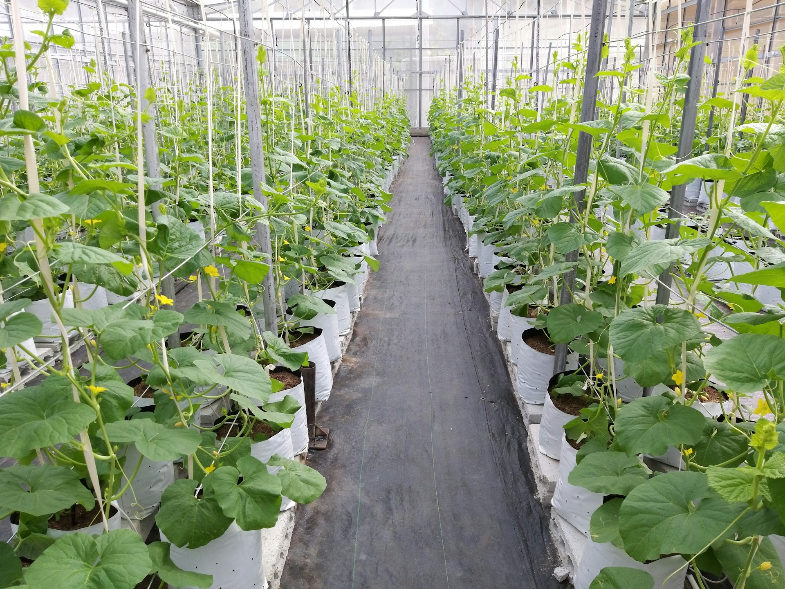
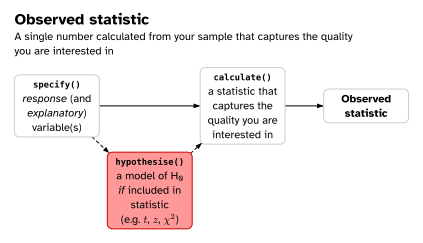
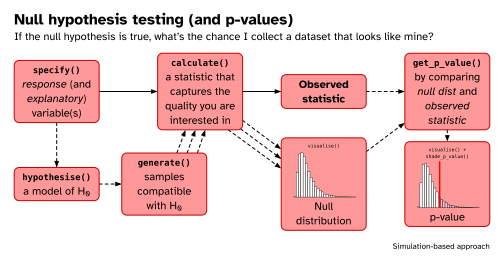
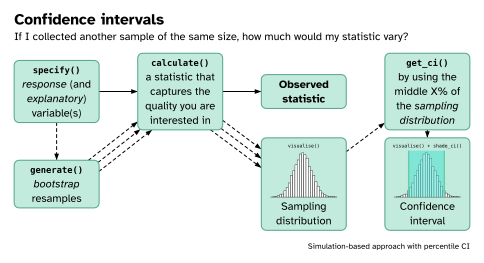

# Get RStudio setup

::: {.callout-note icon="false"}
## ✅ Task

Each time you start a new exercise, you should:

1. Make a new folder in your course folder for the exercise (e.g.
   `bioc13/exercise_2`)
2. Open RStudio
   - If you haven't closed RStudio since the last exercise, I recommend you
     close it and then re-open it. If it asks if you want to save your R Session
     data, choose no.
3. Set your working directory by going to *Session* -> *Set working directory*
   -> *Choose directory*, then navigate to the folder you just made for this
   exercise.
4. Create a new Rmarkdown document (*File* -> *New file* -> *R markdown..*).
   Give it a clear title.

:::

Please ensure you have followed the step above before you start!

## Loading R packages

If you installed the R packages from the last session, you do not need to
reinstall them, only load them into our current R environment. We use the
`library()` function to do that. Since we need this code to run every time we
come back to this RMarkdown document, we should write it in the document. R code
should always be executed "top to bottom", so this bit of code should come right
at the start.

::: {.callout-note icon="false"}
## ✅ Task

Make a code cell and use the `library()` function to load the `tidyverse` and
`infer` packages:

```{r}
library(tidyverse)
library(infer)
```

:::

You are now ready for today's exercise!

--------------------------------------------------------------------------------

# **Effect of fertilizer application on crop growth**



Researchers at Lund University want to understand the effectiveness of three
fertilizers on promoting crop growth. To do that, they construct experimental
arrays of plant pots. The control pots were filled with a standardised soil
mixture. The treatment plots were filled with the same standardised soil mixture
plus the addition of the fertilizer. Already germinated seedlings were randomly
assigned to pots and planted. Plants were kept in the greenhouses, and watered
regularly.

After 30 days, the researchers used a knife to cut all of the plant's biomass
that was above ground. Using an oven, they dried each plant for 24 hours before
recording the mass in grams using a balance.

The results of the experiment are stored in a `.csv` file on
[GitHub](https://github.com/irmoodie/teaching_datasets/blob/main/crop_growth/crop_growth.csv)
or [Canvas](https://canvas.education.lu.se/courses/39437).

::: {.callout-note icon="false"}
## ✅ Task

Download the dataset.

Once downloaded, you should move it to your *working directory* folder for this
exercise before continuing.

:::

## Import the data

We will now import the `crop_growth.csv` dataset.

::: {.callout-note icon="false"}
## ✅ Task

Make another code cell. Load the `crop_growth.csv` data file using the
`read_csv()` function and assign it to an object named `crop_data`.

```{r}
crop_data <- read_csv("crop_growth.csv")
```

:::

## Explore the data

::: {.callout-note icon="false"}
## ✅ Task

In your RMarkdown document, using text below the code cell, answer the following
questions:

1. How many rows of data are in the dataset?
2. What is the unit of observation in this dataset? In other words, what does
   each row represent?
3. What sort of variables are in the dataset (continuous, discrete, nominal,
   ordinal)?
4. What is the minimum and maximum `dry_mass_g` the researchers recorded?

:::

## Plot the data

Below I have provided you with the base `ggplot()` function, but you need to add
a `geom_` to it.

```{r}
crop_data |>
  ggplot(aes(x = treatment, y = dry_mass_g)) #<1>
```

1. To add some geometry add a `+` to the end of this line, then copy the `geom_`
   onto the next line

Some examples geometries could be:

```{r}
geom_boxplot()
```

```{r}
geom_violin()
```

```{r}
geom_jitter(width = 0.1)
```

::: {.callout-note icon="false"}
## ✅ Task

Try each of the `geom_`s out, and decide which you think is best. You can also
add more than one `geom_` to a plot, just add a `+` at the end of a line, then
put the second `geom_` on the next line.

:::

## Calculating the observed statistic



Our research question is:

- Is there a difference in mean `dry_mass_g` between `treatment` groups?

Since we have more than two groups, this sort of analysis is called an ANOVA
(ANalysis Of VAriance). Specifically, it is a *one-way ANOVA*, as we are
interested in the effect of *one* categorical variable (with >2 groups) on a
continuous variable.

::: {.callout-note icon="false"}
## ✅ Task

In your RMarkdown document, using text below the code cell, answer the following
questions:

1. State the null and alternative hypothesis.
2. What is the test statistic we use in an ANOVA?

In a new code cell, calculate the observed test statistic

```{r}
obs_f <-
  ______ |> #<1>
  specify(response = ______, explanatory = ______) |> #<2>
  calculate(stat = "______") #<3>

obs_f #<4>
```
1. The name of the dataset.
2. Specify which is your response and explanatory variable.
3. Calculate the observed statistic. To see the possible names you can use,
   write `?calculate` to open the help files for that function.
4. Print the observe statistic to the console.

:::

## Confidence interval approach

Since the statistic used in an ANOVA unitless ratio (always greater than 0), a
confidence interval is not a very helpful in this case.

If you wanted to use a confidence interval for this question, you could
calculate a confidence interval for the mean of each group, and then compare
them.

If you want to do that, some code is below, but feel free to move onto the
hypothesis test, which is more useful here.

::: {.callout-note icon="false" collapse="true"}
## Confidence interval around the mean of each group

First split the treatments into their own datasets with `filter()`:

```{r}

control_data <-
   crop_data |>
   filter(treatment == "control")

ferta_data <-
   crop_data |>
   filter(treatment == "fertilizer_a")

fertb_data <-
   crop_data |>
   filter(treatment == "fertilizer_b")

fertc_data <-
   crop_data |>
   filter(treatment == "fertilizer_c")

```

Observe mean for each `treatment`:

```{r}

control_data |>
   specify(response = dry_mass_g) |>
   calculate(stat = "mean")

ferta_data |>
   specify(response = dry_mass_g) |>
   calculate(stat = "mean")

fertb_data |>
   specify(response = dry_mass_g) |>
   calculate(stat = "mean")

fertc_data |>
   specify(response = dry_mass_g) |>
   calculate(stat = "mean")

```

95% confidence interval around mean for each dataset:

```{r}

control_data |>
   specify(response = dry_mass_g) |>
   generate(reps = 10000, type = "bootstrap") |>
   calculate(stat = "mean") |>
   get_ci(type = "percentile", level = 0.95)

ferta_data |>
   specify(response = dry_mass_g) |>
   generate(reps = 10000, type = "bootstrap") |>
   calculate(stat = "mean") |>
   get_ci(type = "percentile", level = 0.95)

fertb_data |>
   specify(response = dry_mass_g) |>
   generate(reps = 10000, type = "bootstrap") |>
   calculate(stat = "mean") |>
   get_ci(type = "percentile", level = 0.95)

fertc_data |>
   specify(response = dry_mass_g) |>
   generate(reps = 10000, type = "bootstrap") |>
   calculate(stat = "mean") |>
   get_ci(type = "percentile", level = 0.95)

```

:::

## Null hypothesis testing approach

{fig-align="center"}

### Generating a null distribution

Since our null hypothesis is that there is no relationship between two variables
(i.e., `dry_mass_g` and `treatment` are independent), we can use permuation
(shuffling one of the columns) to simulate a null distribution.

::: {.callout-note icon="false"}
## ✅ Task

In a new code cell, generate a null distribution using the code below:

```{r}
null_dist_f <-
  ______ |> #<1>
  specify(response = ______, explanatory = ______) |> #<2>
  hypothesize(null = "independence") |> #<3>
  generate(reps = 10000, type = "permute") |> #<4>
  calculate(stat = "______") #<5>
```

1. The name of the dataset (I called mine `crop_data`).
2. Specify which is your response and explanatory variable.
3. Our hypothesis is that our response variable is independant of our
   explanatory variable.
4. Simulate data using permuations. This may take a few seconds depending on
   your computer.
5. From each of our simulated permutation samples, calculate the test statistic.

:::

### Compare your observed against the null

In order to see if our statistic could have been observed due to chance, we
should now compare the observed statistic to the null distribution.

::: {.callout-note icon="false"}
## ✅ Task

In a new code cell, plot the null distribution and the observed statistic using
the code below:

```{r}
null_dist_f |>
  visualise() + #<1>
  shade_p_value(obs_stat = obs_f, direction = "greater") + #<2>
  labs(x = "______ statistic") #<3>
```

1. Pipe your `null_dist` object into `visualise()`.
2. Plot your `observed_stat`, and specify that the direction should be
   `"greater"`. Our statistic is naturally bounded at 0, so we are not
   interested in the left side of the distribution.
3. You can change the axis labels to make the plot more clear.

:::

### Calculate a p-value

Let's count up the number of simulations in our null distribution that produced
statistics as or more extreme than our observed statistic, to get a p-value.

::: {.callout-note icon="false"}
## ✅ Task

In a new code cell, use your null distribution to calculate a p-value:

```{r}
null_dist_f |>
  get_p_value(obs_stat = obs_f, direction = "greater")
```

:::

## Did the fertilizers affect the growth of the crops?

::: {.callout-note icon="false"}
## ✅ Task

In your RMarkdown document, using text below the last code cell, answer the
following question:

What are your conclusions? State them both clearly in terms of the research
question and null hypothesis. How would you describe them to someone who does
not know much about statistics? Make reference to your p-value and your figure.

:::

Save your work! Take a break! Then move on to the next question when you're
ready.

--------------------------------------------------------------------------------

# **Species co-occurences in benthic communities**


Co-occurrence patterns of species across a landscape may arise due to shared
habitat preferences, dispersal patterns, community interactions (e.g.
facilitation, competition) or the interaction of these processes. To understand
if communities differ in species composition and/or abundance between open sand
and sea grass habitats in a shallow bay, researchers conducted snorkling
transects and recorded the number of 6 important benthic species.

The dataset the researchers collected can be found as a `.csv` file on
[GitHub](https://github.com/irmoodie/teaching_datasets/blob/main/benthic_species/benthic_species.csv)
or on [Canvas](https://canvas.education.lu.se/courses/39437).

::: {.callout-note icon="false"}
## ✅ Task

Download the dataset.

Once downloaded, you should move it to your *working directory* folder for this
exercise before continuing.

:::

## Import the data

We will now import the `benthic_species.csv` dataset.

::: {.callout-note icon="false"}
## ✅ Task

Make another code cell. Load the `benthic_species.csv` data file using the
`read_csv()` function and assign it to an object named `benthic_data`.

```{r}
benthic_data <- read_csv("benthic_species.csv")
```

:::

## Explore the data

::: {.callout-note icon="false"}
## ✅ Task

In your RMarkdown document, using text below the code cell, answer the following
questions:

1. How many rows of data are in the dataset?
2. What is the unit of observation in this dataset? In other words, what does
   each row represent?
3. What sort of variables are in the dataset (continuous, discrete, nominal,
   ordinal)?

:::

## Plot the data

Here's some code to help you make a bar plot, which is a nice way to display
categorical data:

```{r}
benthic_data |>
  ggplot(aes(x = ______, fill = ______)) + #<1>
  geom_bar()
```

1. This will display one of the variables on the `x` axis, and the other by
   `fill`ing the bar with colour

::: {.callout-note icon="false"}
## ✅ Task

Use the code above to make a plot. Try swapping which variable is mapped to `x`
and which is mapped to `fill`. Which do you think is clearer?

:::

## Calculating the observed statistic


The researchers want to know if the community compositions of the habitats are
the same or different. In other words, are some `species` more likely to be
found in one `habitat` than the another, or are they randomly spread across the
bay.

To do that, we will use a $\chi^2$ statistic. Recall that a $\chi^2$ statistic
measures how different an observed distribution is from an expected
distribution. In this case, how different the observed distribution of species
is in each habitat from the "null" expected distribution of equally split
between habitats (each species is found 50% of the time in each of the two
habitats).

::: {.callout-note icon="false"}
## ✅ Task

In your RMarkdown document, using text below the code cell, answer the following
questions:

1. State the null and alternative hypothesis.

In a new code cell, calculate the observed $\chi^2$ test statistic. Since the
$\chi^2$ statistic itself includes a null hypothesis (as in we need to supply
the expected value), we need to use `hypothesise()` here when calculating it:

```{r}
obs_chi2 <-
  ______ |> #<1>
  specify(response = ______, explanatory = ______) |> #<2>
  hypothesise(null = "independence") |>
  calculate(stat = "______") #<3>

obs_chi2 #<4>
```
1. The name of the dataset.
2. Specify which is your response and explanatory variable.
3. Calculate the observed statistic. To see the possible names you can use,
   write `?calculate` to open the help files for that function.
4. Print the observe statistic to the console.

:::

## Confidence interval approach

Like the $F$ statistic in an ANOVA, $\chi^2$ is unitless ratio (always greater
than 0), so a confidence interval is not a very helpful in this case.

## Null hypothesis testing approach

{fig-align="center"}

### Generating a null distribution

Since our null hypothesis is that there is no relationship between two variables
(i.e., `species` and `habitat` are independent), we could use permuation
(shuffling one of the columns) to simulate a null distribution.

::: {.callout-note icon="false"}
## ✅ Task

In a new code cell, generate a null distribution using the code below:

```{r}
null_dist_chi2 <-
   ______ |> #<1>
   specify(response = ______, explanatory = ______) |> #<2>
   hypothesize(null = "independence") |> #<3>
   generate(reps = 10000, type = "permute") |> #<4>
   calculate(stat = "______") #<5>
```

1. The name of the dataset.
2. Specify which is your response and explanatory variable. In this case, it
   doesn't matter for the statistic, but you might have a preference depending
   on what you think is causing the relationship.
3. Our hypothesis is that our response variable is independant of our
   explanatory variable.
4. Simulate data using permuations. This may take a few seconds depending on
   your computer.
5. From each of our simulated permutation samples, calculate the test statistic.

:::

### Compare your observed against the null

In order to see if our statistic could have been observed due to chance, we
should now compare the observed statistic to the null distribution.

::: {.callout-note icon="false"}
## ✅ Task

In a new code cell, plot the null distribution and the observed statistic using
the code below:

```{r}
null_dist_chi2 |>
  visualise() + #<1>
  shade_p_value(obs_stat = obs_chi2, direction = "greater") + #<2>
  labs(x = "______ statistic") #<3>
```

1. Pipe your `null_dist` object into `visualise()`.
2. Plot your `observed_stat`, and specify that the direction should be
   `"greater"`. Our statistic is naturally bounded at 0, so we are not
   interested in the left side of the distribution.
3. You can change the axis labels to make the plot more clear.

:::

### Calculate a p-value

Let's count up the number of simulations in our null distribution that produced
statistics as or more extreme than our observed statistic, to get a p-value.

::: {.callout-note icon="false"}
## ✅ Task

In a new code cell, use your null distribution to calculate a p-value:

```{r}
null_dist_chi2 |>
  get_p_value(obs_stat = obs_chi2, direction = "greater")
```

:::

## Are the community compositions of the habitats different?

::: {.callout-note icon="false"}
## ✅ Task

In your RMarkdown document, using text below the last code cell, answer the
following question:

What are your conclusions? State them both clearly in terms of the research
question and null hypothesis. How would you describe them to someone who does
not know much about statistics? Make reference to your p-value and your figure.

:::

Save your work! Take a break! Then move on to the next question when you're
ready.

# **Bergmann's rule**

{fig-align="center"}

The Atlantic marsh fiddler crab, *Minuca pugnax*, lives in salt marshes
throughout the eastern coast of the United States. Historically, *M. pugnax*
were distributed from northern Florida to Cape Cod, Massachusetts, but like
other species have expanded their range northward due to ocean warming.

The `pie_crab.csv` dataset is from a study by Johnson and colleagues at the Plum
Island Ecosystem Long Term Ecological Research site.

The dataset can be found on
[GitHub](https://github.com/irmoodie/teaching_datasets/blob/main/pie_crab/pie_crab.csv)
or [Canvas](https://canvas.education.lu.se/courses/39437).

Data sampling overview:

- 13 marshes were sampled on the Atlantic coast of the United States in summer
  2016
- Spanning > 12 degrees of latitude, from northeast Florida to northeast
  Massachusetts
- Between 25 and 37 adult male fiddler crabs were collected, and their carapace
  size (mm) recorded

The dataset was collected to test Bergmann's rule:

> One of the best-known patterns in biogeography is Bergmann's rule. It predicts
> that organisms at higher latitudes are larger than ones at lower latitudes.
> Many organisms follow Bergmann's rule, including insects, birds, snakes,
> marine invertebrates, and terrestrial and marine mammals (Johnson et al.
> 2019).

::: {.callout-note icon="false"}
## ✅ Task

Download the dataset.

Once downloaded, you should move it to your *working directory* folder for this
exercise before continuing.

:::

## Import the data

We will now import the `pie_crab.csv` dataset.

::: {.callout-note icon="false"}
## ✅ Task

Make another code cell. Load the `pie_crab.csv` data file using the `read_csv()`
function and assign it to an object named `pie_crab`.

```{r}
pie_crab <- read_csv("pie_crab.csv")
```

:::

## Explore the data

::: {.callout-note icon="false"}
## ✅ Task

In your RMarkdown document, using text below the code cell, answer the following
questions:

1. How many rows of data are in the dataset?
2. What is the unit of observation in this dataset? In other words, what does
   each row represent?
3. What populations (statistical use of the word) could we make inferences about
   using this data?

:::

## Plot the data

::: {.callout-note icon="false"}
## ✅ Task

Try and figure out how you would use `ggplot()` and `geom_point()` to plot
`latitude` on the `x` axis and `size` on the `y` axis.

Copy some code you used in previous questions and edit it.
:::

## Calculating the observed statistic


The research question is:

- Does *Minuca pugnax* follow Bergmann's rule?

::: {.callout-note icon="false"}
## ✅ Task

In your RMarkdown document, using text below the code cell, answer the following
questions:

1. Use the slides to help you decide what statistic would help you answer this
   question. What test statistic will you use? Why?

In a new code cell, calculate the observed test statistic:

```{r}
obs_stat <-
  ______ |> #<1>
  specify(response = ______, explanatory = ______) |>
  calculate(stat = "______") #<3>

obs_stat #<4>
```

1. The name of the dataset.
2. Calculate the observed statistic.
3. Print the observe statistic to the console.

:::

## Confidence interval approach

{fig-align="center"}

This statistic lends itself well to an interpretable confidence interval, so
let's use one!

::: {.callout-note icon="false"}
## ✅ Task

In a new code cell, calculate the 95% CI for the statistic by first simulating a
sampling distribution using bootstrap resampling.

```{r}
samp_dist <-
  ______ |>  #<1>
  specify(response = ______, explanatory = ______) |>
  generate(reps = ______, type = "______") |> #<2>
  calculate(stat = "______") #<3>

percentile_ci <-
   samp_dist |>
   get_ci(type = "percentile", level = ______) #<4>

percentile_ci #<5>
```

1. The name of the dataset.
2. Decide how you will generate a datasets to use in your sampling distribution.
3. Calculate the statistic for each sample to make a sampling distribution.
4. Set the level to `0.95` for a 95% CI
5. Print the CI

:::

You can also visualise the simulated sampling distribution and confidence
interval.

::: {.callout-note icon="false"}
## ✅ Task

In a new code cell, visualise the 95% CI on the sampling distribution:

```{r}
samp_dist |>
   visualise() |>
   shade_ci(endpoints = percentile_ci)
```

:::

## Hypothesis testing approach

This question could also be answered using a hypothesis test, but we've already
done enough of these. Try to use the confidence interval to answer your
conclusion.

## Does *M. pugnax* follow Bergmann's rule?

::: {.callout-note icon="false"}
## ✅ Task

In your RMarkdown document, using text below the code cell, answer the following
question:

What are your conclusions? How do you use the confidence interval to support
your conclusion?

:::

# Submit your work!

::: {.callout-note icon="false"}
## ✅ Final task

Knit your document to a HTML file. This produces a document that shows your
text, code and the output of your code all in one document.


It will have been saved next to wherever your `.Rmd` file is saved.

Upload your `.html` file as your [assignment for this exercise in
Canvas](https://canvas.education.lu.se/courses/39437/assignments/275274).

:::
